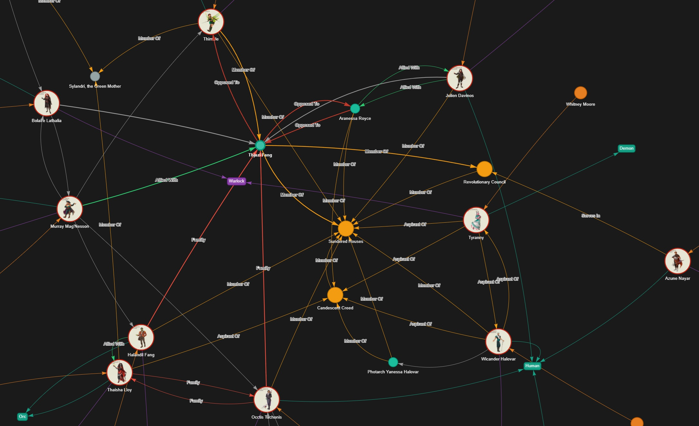

# Crit Graph: Character Relationship Visualizer

Crit Graph is a tool for generating interactive, node-based graphs to visualize complex relationships between characters and factions in a story or world. It's perfect for authors, game masters, and fans who want to map out the intricate web of connections in their favorite fictional universes. An interactive example based on Campaign 4 of Critical Role can be found [here](https://sdmeers.github.io/crit_graph/).



## Features

*   **Interactive Visualization:** Pan, zoom, and click on nodes to explore the relationship graph.
*   **Rich Relationship Types:** Define custom relationships like "Allied With," "Member Of," "Opposed To," and "Family" to capture the nuances of your world.
*   **Character and Faction Nodes:** Create distinct nodes for individual characters and larger groups or factions.
*   **Data-Driven:** The graph is generated from data, making it easy to update and maintain as your story evolves.
*   **Web-Based UI:** The graph is rendered in a browser, making it easy to share and view.

## Technology Stack

*   **Python:** For data processing and setting up the graph data.
*   **vis.js:** A powerful JavaScript library for network visualizations.
*   **Tom Select:** For dropdown menus and selection boxes in the UI.

## How to Run

1.  **Set up the Python environment and install dependencies.**
    This project uses `uv` for package management, as indicated by the `uv.lock` file.
    ```bash
    # It is recommended to create a virtual environment first
    python -m venv .venv
    source .venv/bin/activate
    
    # Install dependencies using uv or pip
    uv pip install -r requirements.txt # A requirements.txt may need to be generated
    ```

2.  **Run the application:**
    ```bash
    python main.py
    ```
    This will likely start a local web server. Open the provided URL in your browser to see the graph.

## Project Structure

The project is organized as follows:

```
├── char_graph.py       # Python script for graph logic
├── main.py             # Main entry point to run the application
├── pyproject.toml      # Project metadata and dependencies
├── lib/                # Frontend libraries (vis.js, tom-select)
├── screenshots/        # Contains example screenshots of the graph
└── ...
```
